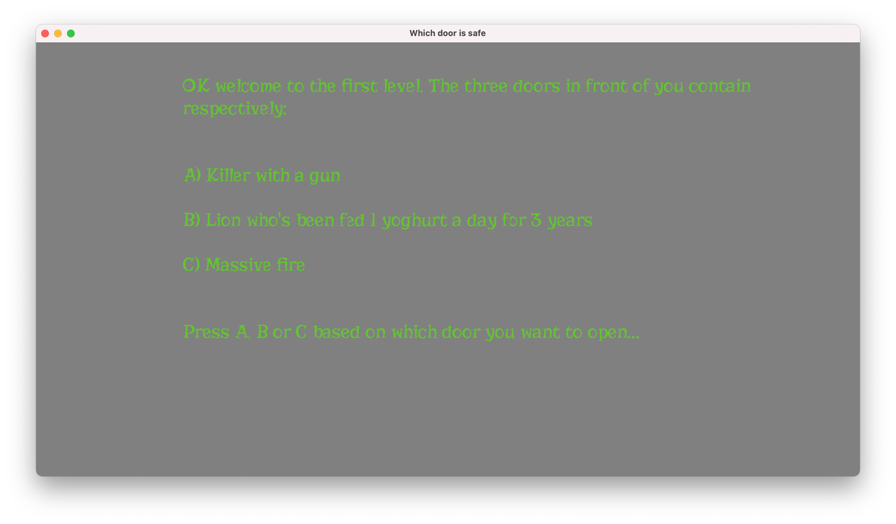

# Which door is safe

Author: Sacha Bartholme

Design:
On a cold Halloween night you wake up in the basement of an abandoned mansion. 
In front of you are three doors, one of which will lead you to the exit.

Text Drawing: 
The text is rendered at runtime using FreeType, HarffBuzz and OpenGL shaders.
The assets of this game are simply text files representing the different levels
and a TrueType font file used for the Halloween styled text. There is a nice
effect which makes the text appear letter by letter instead of all at once.

Choices: 
The game stores narratives as text files. At each level, the user makes a choice
by pressing one of three buttons. 2 buttons will end the game immediately and
1 button makes you progress to the next stage.

Screen Shot:

How To Play:

Press A to continue or either A, B or C to make a choice.

Sources: 
- https://www.riddlesnow.com/riddles/escape-room-riddles/
- https://gedge.ca/blog/2013-12-08-opengl-text-rendering-with-freetype
- https://www.freetype.org/freetype2/docs/tutorial/step1.html
- https://github.com/harfbuzz/harfbuzz-tutorial/blob/master/hello-harfbuzz-freetype.c
- https://www.1001fonts.com/risque-font.html

This game was built with [NEST](NEST.md).

